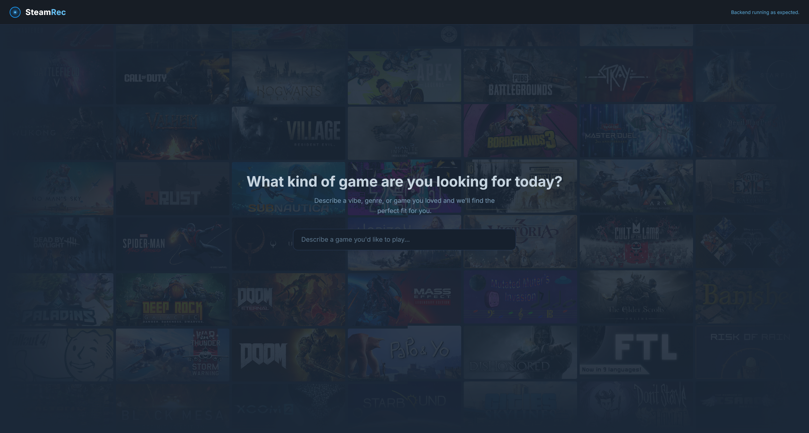
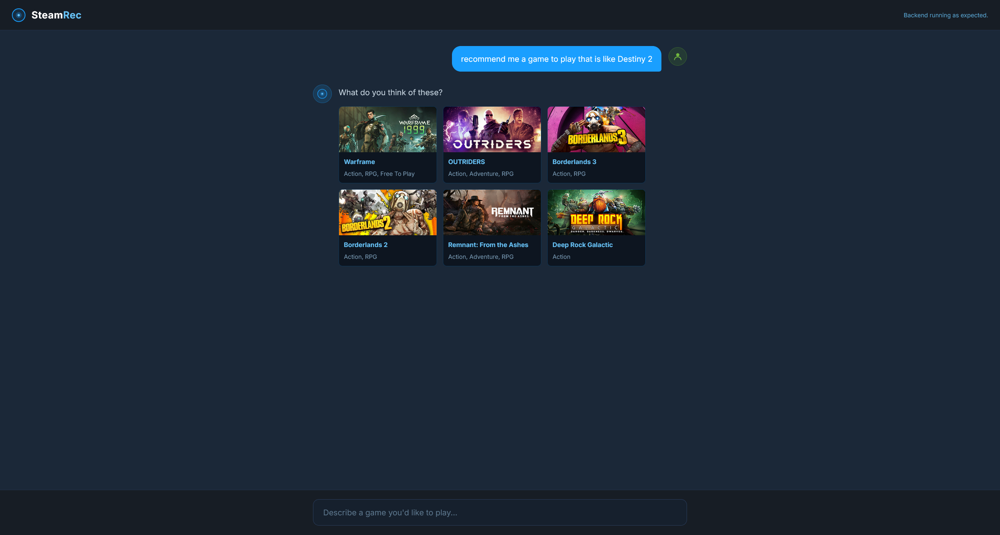

SteamRec
LLM intergrated Steam REST API query

# What is SteamRec?

SteamRec is a **Natural Language Description Game Recommender** for Steam users. Searching for new games, titles that are outside of what you normally play, or what isn't the most popular game right now is difficult. So, that's what SteamRec is for. 

Using Natural Language prompts of descriptions of games that you want to discover, peruse, or play will utilize an LLM that will search for games based on your description, return a few titles, resolve them against a database, and then display several options that contain the Steam Store page link, game names and header images, price, and tags that describe the games.

# Landing Page

# Prompting

